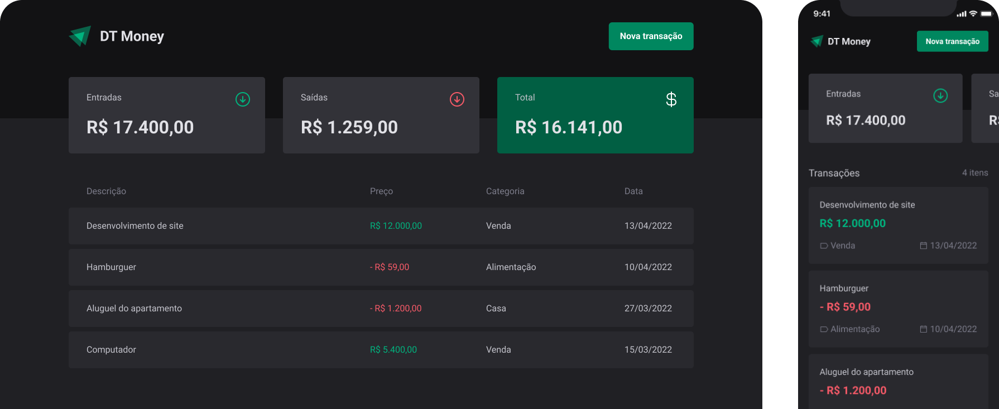

<h1 align="center"> DT-money: RocketSeat</h1>

Projeto exclusivo do Curso ignite da plataforma da Rocketseat

  

## Como usar?

- NPM e NODEJS
- npm i (Para instalar as dependências)
- npm run dev (Para iniciar o servidor de desenvolvimento)

## 💻 Projeto

O DT-money é um projeto que visa fazer um apanhado geral das finanças pessoais e empresariais, dando o total de receitas, pagamentos e despesas. Tudo em uma única tela.

## 🔖 Layout

Você pode visualizar o layout do projeto através [DESSE LINK](https://www.figma.com/community/file/1138814493269096792). É necessário ter conta no [Figma](https://figma.com) para acessá-lo.
